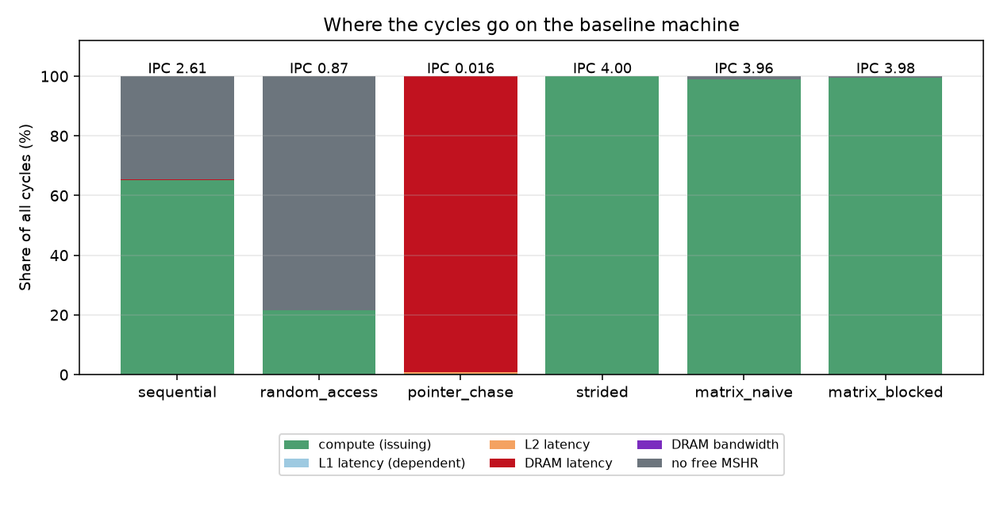
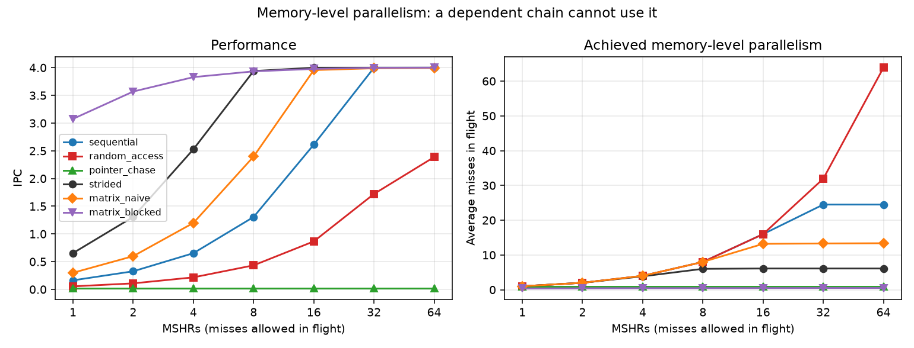
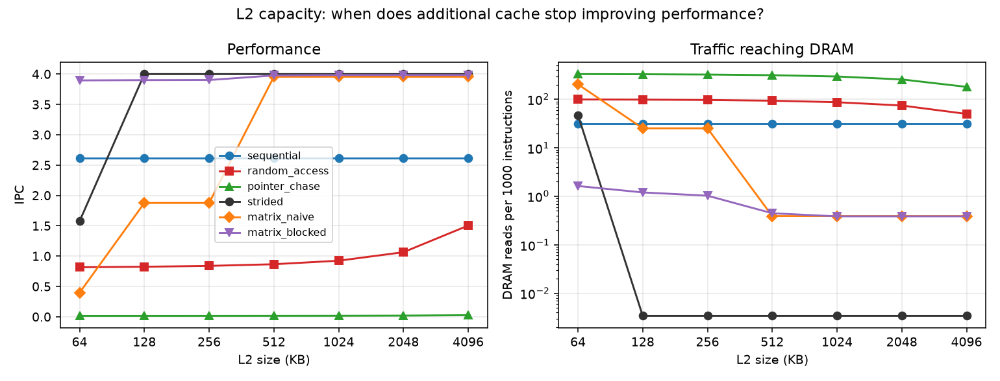
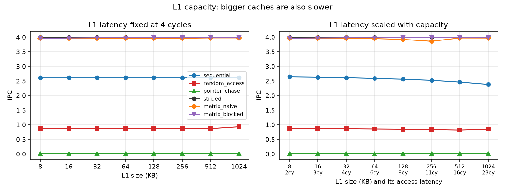
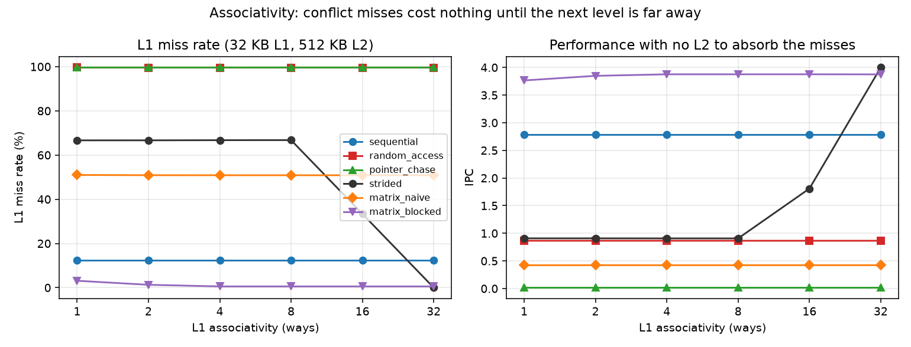
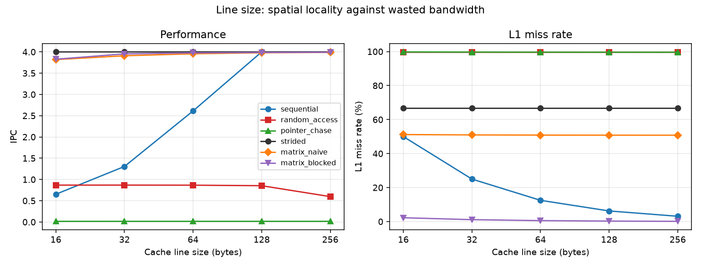
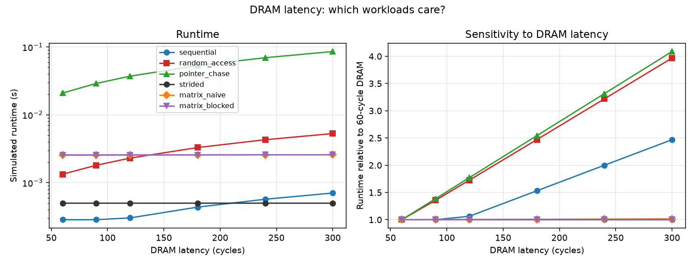
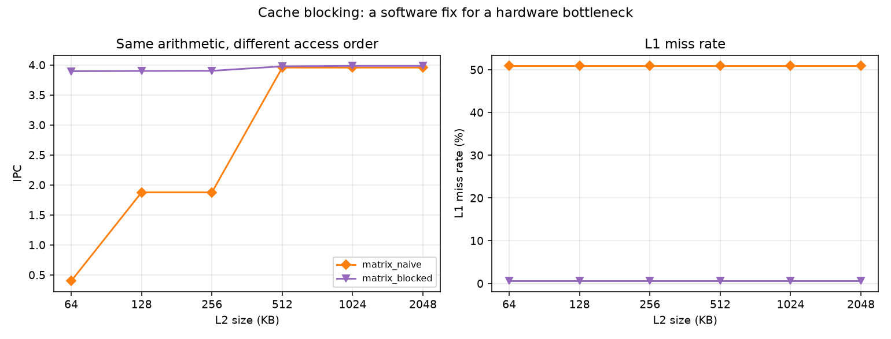
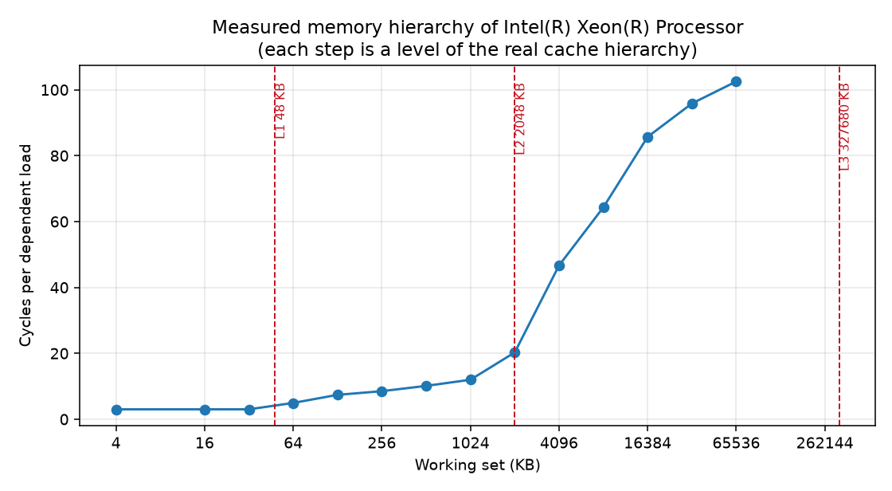

# PerfSim — CPU and memory hierarchy performance simulator

A configurable model of a CPU and its memory hierarchy, plus the tooling to use
it as an architecture exploration platform. It exists to answer one question:

> Given a workload and a hypothetical CPU/memory configuration, what
> architectural bottleneck limits performance, and what change would improve it
> most?

The answer is not a heuristic. `analyze.py` runs every candidate change and
reports the measured result:

```
$ python3 experiments/analyze.py --workload random_access
  change                                 IPC     delta   resulting bottleneck
  (unchanged)                          0.866         -   Memory-level parallelism
  cpu.mshrs: 16 -> 64                  2.387    175.7%   DRAM bandwidth
  cpu.mshrs: 16 -> 32                  1.722     98.8%   Memory-level parallelism
  memory.latency_cycles: 180 -> 90     1.577     82.1%   Memory-level parallelism
  l2.size_kb: 512 -> 4096              1.503     73.6%   Memory-level parallelism
  ...
  l1.size_kb: 32 -> 64                 0.866      0.0%   Memory-level parallelism

Best tested modification
  cpu.mshrs: 16 -> 64
  IPC 0.866 -> 2.387 (+175.7%), runtime 3.30 ms -> 1.20 ms
  The bottleneck moves from Memory-level parallelism to DRAM bandwidth.
```

Run the same analysis on `pointer_chase` — a workload with an almost identical
miss rate — and quadrupling the MSHRs is worth **+0.0%**, while halving DRAM
latency is worth +83.5%. Two workloads that look the same in a cache simulator
need completely different hardware. Explaining that difference is what this
project is for.

---

## Contents

- [Quick start](#quick-start)
- [What the model actually models](#what-the-model-actually-models)
- [Workloads](#workloads)
- [Findings](#findings)
- [Model against hardware](#model-against-hardware)
- [Optimising the simulator itself](#optimising-the-simulator-itself)
- [Repository layout](#repository-layout)
- [What is deliberately not modelled](#what-is-deliberately-not-modelled)
- [Reproducing everything](#reproducing-everything)

---

## Quick start

```bash
# Build (C++20; g++ is used explicitly because clang on some distros
# cannot find libstdc++)
cmake -S . -B build -DCMAKE_BUILD_TYPE=Release -DCMAKE_CXX_COMPILER=g++
cmake --build build -j
ctest --test-dir build            # 37 unit tests

# Generate a trace and simulate it
./build/tracegen pointer_chase --n 1000000 --out traces/pointer_chase.trace
./build/perfsim --config configs/baseline.json --trace traces/pointer_chase.trace

# Or pipe the generator straight in, without touching disk
./build/tracegen sequential --n 1000000 --out - \
  | ./build/perfsim --config configs/baseline.json --trace -

# Machine-readable output for the Python layer
./build/perfsim --config configs/baseline.json --trace traces/x.trace \
  --quiet --json results/x.json
```

Python side (needs `pandas` and `matplotlib`):

```bash
python3 experiments/run_experiments.py --all      # 372 simulations, ~18 s
python3 experiments/plot.py --all                 # figures into results/figures/
python3 experiments/analyze.py --workload all     # diagnosis + ranked fixes
python3 experiments/validate.py                   # model against this host
python3 experiments/benchmark.py                  # simulator's own throughput
```

### Example report

```
$ ./build/perfsim --config configs/baseline.json --trace traces/pointer_chase.trace
PerfSim Architecture Analysis
=============================

Workload:  traces/pointer_chase.trace
CPU:       3.50 GHz, 4-wide issue, 16 MSHRs, compute CPI 0.25
L1:        32 KB, 8-way, 64 B line, 4 cycles
L2:        512 KB, 8-way, 64 B line, 12 cycles
DRAM:      180 cycles, 50.0 GB/s

Performance
-----------
  Instructions:                   3,000,000
  Cycles:                       186,299,824
  IPC:                                0.016
  CPI:                                62.10
  Execution time:                 53.229 ms

Memory hierarchy
----------------
  L1 accesses:                    1,000,000   hit rate   0.4%
  L2 accesses:                      996,362   hit rate   5.4%
  DRAM accesses:                    942,186
  Average memory latency:             185.5 cycles
  Avg outstanding misses:              1.00
  DRAM traffic:                     57.5 MB   1.1 GB/s (2.3% of 50.0 GB/s)

Stall breakdown (share of total cycles)
---------------------------------------
  Compute                      0.4%  750,000
  L1 (dependent loads)         0.0%  14,552
  L2                           0.5%  866,816
  DRAM latency                99.1%  184,668,456  ##################################
  DRAM bandwidth               0.0%  0
  MSHR (none free)             0.0%  0

Diagnosis
---------
  Primary bottleneck: DRAM latency
  Waiting for DRAM costs 99% of cycles and the bus is not saturated, so the
  exposed latency is the problem.
  Suggested changes:
    1. Increase l2.size_kb to keep the working set on chip
    2. Reduce memory.latency_cycles
    3. Increase cpu.mshrs if the misses are independent
```

`Avg outstanding misses: 1.00` is the whole story for this workload: the machine
has 16 MSHRs and can only ever use one of them.

---

## What the model actually models

This is an **architectural performance model**, not a cycle-accurate simulator.
There is no pipeline, no instruction decode and no register renaming. There is a
cycle counter, and the model is precise about what adds to it.

### Trace format

A trace is a line-oriented text file describing what the CPU executed:

```
# perfsim-trace v1
N 3          three instructions that touch no memory
R 0x1000     load
W 0x2000     store
L 0x3000     dependent load: this address came out of the previous load
```

The `R`/`L` distinction is the one thing this format has that a plain address
list does not, and it is what makes the model able to tell a pointer chase apart
from a random walk. Addresses may be hex (`0x...`) or decimal.

### Caches

Set-associative, LRU, write-back, write-allocate. Size, line size,
associativity and latency are configurable per level, and L2 can be omitted
entirely. A dirty line evicted from L1 is installed into L2 as a writeback; those
writebacks are counted separately from demand accesses, so the reported hit rate
describes the workload's locality rather than eviction timing.

### DRAM

Fixed latency plus a bandwidth limit. There are no banks, rows or refresh.
Bandwidth is enforced by tracking when the bus next becomes free, so a workload
demanding more bytes per cycle than the bus can carry sees its effective latency
grow. Writebacks consume bandwidth but never expose latency.

### CPU

Two things add to the cycle counter:

1. **Issue bandwidth.** Every instruction costs `compute_cpi` cycles, so a 4-wide
   machine retires four instructions per cycle when nothing is stalling.
   `base_cpi` optionally raises that floor to fold in effects the model does not
   simulate (ALU dependence chains, branch mispredictions).

2. **Exposed memory latency.** Misses are non-blocking. An independent miss costs
   nothing directly — it is overlapped with later work — but it occupies an MSHR
   until its fill completes. Once every MSHR is busy the CPU cannot start another
   miss, and memory-level parallelism becomes the limit. A **dependent** load
   (`L`) cannot be overlapped at all and exposes its entire latency.

Cache levels are probed in series, so latency adds up: an L1 hit costs 4 cycles,
an L2 hit costs 4 + 12, and a DRAM access costs 4 + 12 + 180.

### Stall attribution

Every stalled cycle lands in exactly one of five buckets, and the buckets sum to
the total, so the breakdown is a true partition of the machine's time:

| bucket | meaning |
| --- | --- |
| `l1` | dependent load that hit in L1 — the workload is serialised on its own load chain |
| `l2` | cycles lost to accesses supplied by L2 |
| `dram` | cycles lost to accesses supplied by DRAM (latency only) |
| `bandwidth` | of those cycles, the share spent queueing for the DRAM bus |
| `mshr` | no MSHR was free, so no further miss could be started |

Cycles are charged to the level that *supplied the data*, so `dram` reads as
"cycles lost to accesses that went to DRAM". The `bandwidth` split matters more
than it looks: independent misses never expose their own latency, so a bandwidth
limit reaches the CPU only through MSHR occupancy. Each MSHR entry therefore
records what share of its fill was bus queueing, and stalls behind it are split
accordingly. Without that, a bandwidth-bound workload would report itself as an
MSHR problem and the suggested fix would be wrong.

---

## Workloads

Each workload exists twice, built from the same parameters in the same file: once
as a trace generator, once as a real kernel that can be executed and timed. That
is what stops the two from drifting apart.

| workload | pattern | stresses |
| --- | --- | --- |
| `sequential` | stride-1 scan of 8 MB | spatial locality, streaming bandwidth |
| `random_access` | independent random loads over 8 MB | memory-level parallelism |
| `pointer_chase` | dependent loads round a random cycle over 8 MB | raw memory latency |
| `strided` | random loads into 24 structures 4 KB apart | conflict misses |
| `matrix_naive` | 192×192 multiply, textbook loop nest | cache capacity |
| `matrix_blocked` | the same multiply, 32×32 tiles | the value of locality |

`matrix_naive` and `matrix_blocked` are the *same function* with a different
blocking factor, so they execute identical arithmetic and produce
bit-identical checksums. Only the access order differs.

`strided` deserves a note: only one cache line per structure is ever read, so its
touched data is 1.5 KB and fits in any cache here. But with a 4 KB stride every
structure maps to the same set, so associativity alone decides whether an access
hits. None of the other five workloads produces conflict misses, which is why it
exists.

### Baseline behaviour

3.5 GHz, 4-wide, 16 MSHRs, 32 KB 8-way L1, 512 KB 8-way L2, 180-cycle DRAM at
50 GB/s:

| workload | IPC | CPI | L1 hit | L2 hit | avg mem latency | misses in flight | bottleneck |
| --- | --- | --- | --- | --- | --- | --- | --- |
| `sequential` | 2.61 | 0.38 | 87.5% | 0.0% | 28.0 cy | 16.00 | memory-level parallelism |
| `random_access` | 0.87 | 1.15 | 0.4% | 6.1% | 184.6 cy | 15.99 | memory-level parallelism |
| `pointer_chase` | 0.02 | 62.10 | 0.4% | 5.4% | 185.5 cy | 1.00 | DRAM latency |
| `strided` | 4.00 | 0.25 | 33.2% | 100.0% | 12.0 cy | 6.11 | compute |
| `matrix_naive` | 3.96 | 0.25 | 49.1% | 99.8% | 10.3 cy | 13.20 | compute |
| `matrix_blocked` | 3.98 | 0.25 | 99.4% | 80.6% | 4.3 cy | 0.48 | compute |



---

## Findings

All figures below are generated by `experiments/plot.py` from the CSVs in
`results/`, which come from 372 simulations across eight sweeps.

### 1. Miss rate does not predict performance

`random_access` and `pointer_chase` both miss in L1 on more than 99.5% of
accesses (hit rates 0.41% and 0.36%) and both see ~185 cycles of average memory
latency. Performing the same 1,000,000 memory accesses takes **3.30 ms** and
**53.23 ms** — a **16×** difference.

Their IPC differs by more still, 0.866 against 0.016, but part of that gap is
instruction mix rather than performance: the random-access loop runs a
pseudorandom number generator per access while the chase loop runs almost
nothing, so IPC flatters `random_access`. Runtime is the honest comparison here,
because both workloads issue exactly the same number of memory accesses.

The entire difference is overlap. `random_access` sustains 15.99 misses in
flight; `pointer_chase` sustains 1.00, because each load's address is the
previous load's result. A cache simulator that reports only hit rates cannot
tell these two apart, and would recommend the same fix for both.

### 2. Memory-level parallelism, and who can use it



IPC against MSHR count, 1 → 64:

| workload | 1 | 2 | 4 | 8 | 16 | 32 | 64 |
| --- | --- | --- | --- | --- | --- | --- | --- |
| `sequential` | 0.16 | 0.33 | 0.65 | 1.31 | 2.61 | 4.00 | 4.00 |
| `random_access` | 0.05 | 0.11 | 0.22 | 0.43 | 0.87 | 1.72 | 2.39 |
| `matrix_naive` | 0.30 | 0.60 | 1.20 | 2.40 | 3.96 | 3.99 | 3.99 |
| `pointer_chase` | 0.02 | 0.02 | 0.02 | 0.02 | 0.02 | 0.02 | 0.02 |

Everything with independent misses scales almost linearly until it hits another
limit. `pointer_chase` is flat to five decimal places across a 64× increase in
miss parallelism: a dependent chain cannot use any of it. `random_access` stops
scaling between 32 and 64 MSHRs not because of MLP but because it starts
saturating the DRAM bus — the analyzer above reports the bottleneck moving to
"DRAM bandwidth" at 64 MSHRs.

**Conclusion.** MSHR count is the single most valuable knob for
independent-miss workloads (44× for `random_access` from 1 to 64 MSHRs) and
worth exactly nothing for dependent ones.

### 3. Cache capacity, and where it stops helping



IPC against L2 size:

| workload | 64 KB | 128 KB | 256 KB | 512 KB | 1 MB | 2 MB | 4 MB |
| --- | --- | --- | --- | --- | --- | --- | --- |
| `matrix_naive` | 0.40 | 1.88 | 1.88 | 3.96 | 3.96 | 3.96 | 3.96 |
| `strided` | 1.58 | 4.00 | 4.00 | 4.00 | 4.00 | 4.00 | 4.00 |
| `random_access` | 0.82 | 0.82 | 0.84 | 0.87 | 0.92 | 1.06 | 1.50 |
| `sequential` | 2.61 | 2.61 | 2.61 | 2.61 | 2.61 | 2.61 | 2.61 |

**Conclusion.** Capacity helps until the working set fits, then stops dead.
`matrix_naive` gains 10.0× between 64 KB and 512 KB (its three 288 KB matrices
start to fit) and then exactly nothing from a further 8× of cache.
`random_access` never plateaus in this range because its working set is 8 MB, so
each doubling of L2 catches proportionally more of it. `sequential` is perfectly
flat: it never reuses a line, so cache capacity is irrelevant at any size.

### 4. A bigger cache is also a slower cache



Sweeping L1 capacity at a fixed 4-cycle latency shows almost nothing. That
sweep describes a cache that is free to enlarge, which is not a real option, so
the right panel scales latency with capacity (`4 × sqrt(size/32 KB)`, anchored
on the baseline).

| L1 size | 8 KB | 32 KB | 128 KB | 256 KB | 512 KB | 1 MB |
| --- | --- | --- | --- | --- | --- | --- |
| latency | 2 cy | 4 cy | 8 cy | 11 cy | 16 cy | 23 cy |
| `sequential` IPC | 2.64 | 2.61 | 2.56 | 2.52 | 2.46 | 2.38 |
| `matrix_naive` IPC | 3.96 | 3.96 | 3.92 | 3.85 | 3.97 | 3.97 |

**Conclusion.** For a workload with no reuse, a bigger L1 is strictly worse:
`sequential` loses 10% of its IPC on the way from 8 KB to 1 MB, paying latency
for a hit rate it cannot improve. `matrix_naive` is non-monotonic — it degrades
to 256 KB, then recovers at 512 KB where its 288 KB inner working set finally
fits and the improved hit rate outweighs the extra 16-cycle latency. Capacity
sweeps that hold latency constant will always overstate the case for a big
cache.

### 5. Conflict misses cost nothing until the next level is far away



`strided` on a 32 KB L1, sweeping associativity with capacity held constant:

| associativity | 1 | 2 | 4 | 8 | 16 | 32 |
| --- | --- | --- | --- | --- | --- | --- |
| L1 miss rate | 66.7% | 66.7% | 66.7% | 66.8% | 33.4% | 0.0% |
| IPC, 512 KB L2 | 4.00 | 4.00 | 4.00 | 4.00 | 4.00 | 4.00 |
| IPC, no L2 | 0.91 | 0.91 | 0.91 | 0.91 | 1.81 | 4.00 |

Two things worth noticing. First, the miss rate is flat from 1-way to 8-way,
which is not what one might expect: holding total capacity fixed means adding
ways also removes sets, so the number of aliasing lines per set grows in step
with the ways available to hold them. Associativity only helps once the ways
exceed the aliasing lines — here, above 16.

Second, **the same conflict misses cost 0% on the baseline machine and 4.4× on a
machine with no L2**. A 512 KB L2 absorbs all of them at 12 cycles, and 16 MSHRs
hide that entirely.

**Conclusion.** Associativity is not worth paying for on its own merits; it is
worth paying for in proportion to the cost of the level behind it. Reporting the
L1 miss rate without saying what serves those misses says nothing about
performance.

### 6. Line size trades spatial locality against wasted traffic



| line size | 16 B | 32 B | 64 B | 128 B | 256 B |
| --- | --- | --- | --- | --- | --- |
| `sequential` | 0.65 | 1.31 | 2.61 | 4.00 | 4.00 |
| `random_access` | 0.87 | 0.87 | 0.87 | 0.85 | 0.60 |
| `matrix_blocked` | 3.83 | 3.95 | 3.98 | 3.99 | 3.99 |

**Conclusion.** Line size is the one parameter in this study where the two
extremes of the workload mix want opposite things. `sequential` gains 6.1× from
16 B to 128 B lines, since one miss serves 8 elements instead of 2.
`random_access` loses 31% going from 64 B to 256 B: it uses 8 bytes of every line
fetched, so a larger line is pure wasted bandwidth. 64 B is the compromise, which
is why real hardware picked it.

### 7. Latency sensitivity is not universal



IPC against DRAM latency, 60 → 300 cycles:

| workload | 60 cy | 120 cy | 180 cy | 300 cy | slowdown |
| --- | --- | --- | --- | --- | --- |
| `pointer_chase` | 0.04 | 0.02 | 0.02 | 0.01 | 4.1× |
| `random_access` | 2.14 | 1.24 | 0.87 | 0.54 | 4.0× |
| `sequential` | 4.00 | 3.76 | 2.61 | 1.62 | 2.5× |
| `matrix_naive` | 3.99 | 3.97 | 3.96 | 3.93 | 1.02× |
| `matrix_blocked` | 3.99 | 3.98 | 3.98 | 3.96 | 1.01× |

**Conclusion.** A 5× change in DRAM latency changes matrix multiply performance
by 1–2% and pointer-chasing performance by 4.1×. Buying lower-latency memory is
worth almost exactly nothing for a workload whose working set is cached, which is
why the answer to "would faster memory help?" is always "for which workload?".

### 8. Software can fix a hardware bottleneck (matrix blocking)



Identical arithmetic, identical results, different access order:

| L2 size | `matrix_naive` IPC | `matrix_blocked` IPC | speedup from blocking |
| --- | --- | --- | --- |
| 64 KB | 0.40 | 3.90 | **9.8×** |
| 128 KB | 1.88 | 3.90 | 2.1× |
| 512 KB | 3.96 | 3.98 | 1.01× |
| 2 MB | 3.96 | 3.98 | 1.01× |

At a 64 KB L2 the numbers behind that 9.8×:

| | naive | blocked |
| --- | --- | --- |
| L1 hit rate | 49.1% | 99.4% |
| DRAM reads | 7,231,872 | 58,368 |
| average memory latency | 102.2 cy | 4.8 cy |

The chain is: the naive nest walks `B` down a column, so it reuses each line only
after touching the entire matrix → the reuse distance exceeds the cache →
misses → 124× more DRAM traffic → exposed latency and MSHR pressure → 102 cycles
average memory latency instead of 4.8 → 9.8× the runtime.

**Conclusion.** Tiling is worth 9.8× on a machine with a small last-level cache
and nothing at all once the working set fits. The naive version is not slow
because of its arithmetic; it is slow because of the order in which it asks for
memory. Note also that `matrix_blocked` is nearly insensitive to L2 size — a
blocked kernel does not need the hardware to be generous.

---

## Model against hardware

`experiments/validate.py` checks the model against the machine it is running on.
Hardware counters are unavailable in this VM (`perf_event_open` returns ENOENT
for every hardware event, and the `perf` binary is not installed), so validation
uses two things that need no PMU: the host's own cache geometry from sysfs, and
its real access latency measured by timing a dependent pointer chase over
growing working sets.



The steps line up with what the host reports: 3 cycles inside its 48 KB L1d,
5–12 cycles through its 2 MB L2, and 50–106 cycles beyond it. Those measured
latencies are then fed into the model along with the detected geometry.

Host: Intel Xeon, 2.4 GHz, 48 KB 12-way L1d, 2 MB 16-way L2, large shared L3.

| workload | native | model | model/native |
| --- | --- | --- | --- |
| `pointer_chase` | 26.1 ms | 27.7 ms | **1.06×** |
| `sequential` | 0.3 ms | 0.4 ms | 1.32× |
| `random_access` | 2.8 ms | 1.7 ms | 0.61× |
| `matrix_naive` | 5.7 ms | 3.7 ms | 0.65× |
| `matrix_blocked` | 2.1 ms | 3.7 ms | 1.82× |
| `strided` | 2.5 ms | 0.7 ms | 0.29× |

### What the model captures

**Pure latency, to within 6%.** `pointer_chase` is the case the model describes
directly — one exposed miss at a time — and it predicts a 26.1 ms measured
runtime as 27.7 ms. The measured latency curve is also reproduced by the model's
own hierarchy, which is a consistency check on the cache geometry and the
serial-lookup latency assumption.

**Ordering.** In every comparison the model puts the workloads in the correct
order and identifies the correct qualitative reason.

### What the model fails to capture

**Absolute compute throughput.** For a compute-bound workload the prediction is
only as good as two guesses: the issue width, and the estimated instruction count
per iteration baked into the trace generators. `matrix_blocked` is over-predicted
by 1.82× because the host sustains more work per cycle than a 4-wide machine with
5 instructions per multiply-add. `base_cpi` exists to calibrate this, and this
measurement is what you would calibrate it against.

**Misses that stop at L2 are hidden too completely.** The three workloads whose
misses are absorbed by L2 are all over-predicted: `strided` (0.29×),
`matrix_naive` (0.65×), `matrix_blocked` (1.82× the other way). The sharpest
form of this:

| | native | model |
| --- | --- | --- |
| naive / blocked matrix multiply | 2.78× | 0.99× |

On real hardware, blocking is worth 2.78× at this size. The model says the two are
equivalent, because with a 2 MB L2 holding the working set, every L1 miss becomes
a 12-cycle L2 hit that 16 MSHRs overlap away. Three things could explain the
gap — no TLB model (the naive nest walks `B` with a 1536-byte stride, touching 72
pages per column and revisiting them constantly), no load-port or reorder-buffer
limit, and no L2-to-L1 fill bandwidth limit. **Hardware counters would
discriminate between them**, and cannot be read here; that is the specific reason
`tools/perfcount.cpp` exists rather than being deleted as unused.

**Prefetching.** The model has none, so it under-predicts sequential performance:
measured `random_access`/`sequential` is 8.75×, the model says 4.06×. This is
also why `sequential` reports "memory-level parallelism" as its bottleneck at
87.5% L1 hit rate — without a prefetcher, 1-in-8 accesses miss and the 16 MSHRs
throttle a workload that real hardware streams comfortably.

All three discrepancies point the same direction as their causes predict, which
is the most one can ask of a model this simple.

---

## Optimising the simulator itself

There are two performance levels in this project: the simulated machine, and the
simulator. `perf` is unavailable here, so the simulator was profiled with gprof
(`-DPERFSIM_PROFILE=ON`). Replaying a 21.3M-record trace showed three hotspots;
full before/after profiles are in
[results/profile_before_after.txt](results/profile_before_after.txt).

| hotspot found | fix | self time per call |
| --- | --- | --- |
| `Cache::access`, 41% — line state was an array of 24-byte structs, so an 8-way tag scan strided over three host cache lines | parallel tag/timestamp/dirty arrays; one aligned 64-byte host line per scan | 12.58 → 2.33 ns |
| `Cpu::access`, 23% — every miss scanned all 16 MSHRs linearly for the one that frees up soonest | binary min-heap on completion time | 10.54 → 3.52 ns |
| `TraceReader::refill`, 14% — **120.8M calls** for 21.3M records, once per character | buffer once per record, then parse on raw pointers | ~8.0 → 5.63 ns |

Throughput, measured by `experiments/benchmark.py` over all six traces
(51M records):

| | M records/s | time |
| --- | --- | --- |
| before | 26.85 | 1.90 s |
| after cache layout change | 30.79 | |
| after MSHR heap | 33.77 | |
| after parser change | **43.48** | **1.17 s** |

**+62% throughput, 38% less wall time.**

Correctness was the constraint, and the 37 unit tests were the guard: all passed
unchanged at every step. Additionally, the pre- and post-optimisation binaries
were compared across 30 workload/config combinations, checking 23 fields each.
Cycles, IPC, CPI, runtime, every cache and DRAM counter, total stall cycles and
the bottleneck verdict are **identical**. One difference exists and is worth
stating precisely: the split of stall cycles between the `mshr` and `bandwidth`
buckets shifts by at most **0.026%** of a run's total cycles, because the heap
breaks ties between MSHRs freeing on the same cycle differently than the linear
scan did. The stall lengths are unchanged; only which entry's queueing share
they are charged to moves. Fixing that would mean adding a tie-breaking key to
the hottest loop in the simulator to change a diagnostic sub-bucket by a
fraction of a percent, which is not a good trade.

Text parsing is now the largest single cost (48%). The next step would be a
binary trace format — a format change rather than an optimisation of existing
code, so it is left undone.

---

## Repository layout

```
include/, src/        the simulator
  json                minimal JSON reader/writer (configs and results)
  config              architecture description; rejects unknown keys
  trace               streaming trace reader and writer
  cache               set-associative LRU cache
  memory              DRAM model and the L1 -> L2 -> DRAM hierarchy
  cpu                 timing model: issue width, MSHRs, stall attribution
  simulator           drives a trace, derives metrics, classifies the bottleneck
  report              the human-readable report
  main                CLI, including --benchmark

workloads/            six workloads, each as both a trace generator and a
                      real kernel built from the same parameters

tools/perfcount.cpp   perf stat replacement built on perf_event_open directly,
                      so it works without the perf binary and degrades cleanly
                      when the host exposes no PMU

configs/              baseline, large_l2, fast_memory, low_bandwidth, l1_only

experiments/
  perfsim.py          shared plumbing: traces, configs, running the simulator
  run_experiments.py  parameter sweeps -> results/*.csv
  analyze.py          diagnosis plus measured ranking of candidate changes
  plot.py             figures -> results/figures/
  validate.py         model against the host it runs on
  benchmark.py        the simulator's own throughput

tests/                37 unit tests, each with hand-computed expectations
results/              committed CSVs, figures and profiles
```

Configuration rejects unknown keys. A mistyped sweep parameter such as
`l2.size_mb` would otherwise silently produce a whole set of results for the
wrong machine, which is a much more expensive kind of bug than a crash.

---

## What is deliberately not modelled

Each of these would change the numbers above, and none is simulated:

- **Hardware prefetching.** The largest single source of error, and the reason
  `sequential` looks MLP-bound.
- **TLB and page translation.** Probably the main reason `matrix_naive` is
  over-predicted.
- **Out-of-order execution details.** No reorder buffer, no load/store queues, no
  finite load ports. The reorder buffer was considered and left out: with 16
  MSHRs, the MSHR limit binds first in every workload here, so a window model
  would have added a knob that changes nothing.
- **Branch prediction**, and therefore no front-end stalls. Folded into
  `base_cpi` if you want it.
- **L3, multiple cores, coherence, NUMA.** The model's "DRAM" is whatever sits
  behind L2; on a host with a large shared L3, that is the L3.
- **Real DRAM timing.** No banks, rows, refresh, or read/write turnaround.
- **Instruction fetch.** Traces describe data accesses only.

The scalar/vector question is handled rather than ignored: traces describe a
scalar instruction stream, so `tracegen` is built with `-fno-tree-vectorize`.
Otherwise the native kernels would execute a different program from the one the
simulator is given and the hardware comparison would mean nothing.

---

## Reproducing everything

```bash
cmake -S . -B build -DCMAKE_BUILD_TYPE=Release -DCMAKE_CXX_COMPILER=g++
cmake --build build -j
ctest --test-dir build

cd experiments
python3 run_experiments.py --all     # 372 simulations -> results/*.csv
python3 plot.py --all                # -> results/figures/
python3 validate.py --repeats 3      # -> results/validation.json
python3 benchmark.py --label after   # -> results/benchmark_after.json
python3 analyze.py --workload all    # diagnosis for every workload
```

Traces are generated on demand into `traces/` and are not committed (the two
matrix traces are ~200 MB each). A sidecar `.params` file records what each
trace was generated with, so changing a workload's parameters regenerates it
rather than silently reusing stale data.

The sweep CSVs are byte-for-byte reproducible: two independent runs of
`run_experiments.py --all` produce identical files, so re-running produces an
empty diff unless something in the model actually changed. `validate.py`,
`benchmark.py` and the latency curve are timing measurements and will differ
slightly from run to run.

To reproduce the profile:

```bash
cmake -S . -B build-profile -DCMAKE_BUILD_TYPE=Release \
      -DCMAKE_CXX_COMPILER=g++ -DPERFSIM_PROFILE=ON
cmake --build build-profile -j
cd /tmp && /path/to/build-profile/perfsim --config configs/baseline.json \
      --trace traces/matrix_naive.trace --quiet
gprof /path/to/build-profile/perfsim gmon.out | head -20
```
